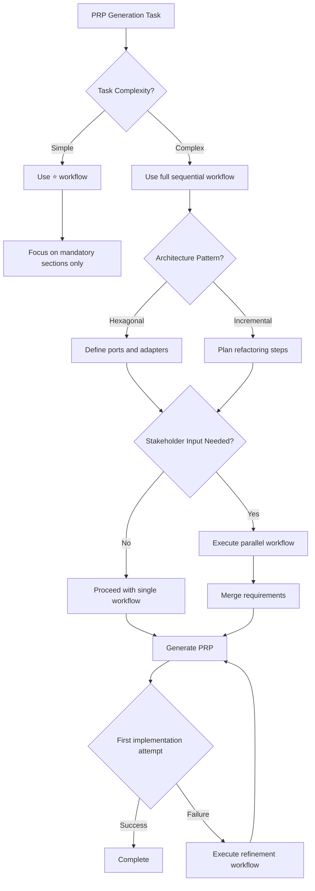

# Workflow Patterns for PRP Generation

## Sequential Workflows

### PRP Generation Workflow (Full Process)

For complex backend development tasks, follow this sequential workflow:

1. **Context Validation**
   - Validate context stack layers exist
   - Check conflicts between static rules and dynamic context
   - Verify skill metadata score ≥ 75
   - Ensure token budget < 1000 tokens

2. **Metadata & Business Context**
   - Generate PRP ID and metadata
   - Extract business objectives and SLAs
   - Identify stakeholders and priorities

3. **Technical Translation**
   - Define architecture pattern (Hexagonal Architecture)
   - Specify technology stack with exact versions
   - Detail security and performance requirements

4. **Specification Output**
   - List expected deliverables (⭐ for mandatory items)
   - Define code structure following FCIS principles
   - Specify environment configuration

5. **Validation Framework**
   - Define testing strategy with TDD process
   - Set quality gates (code quality, security, architecture)
   - Specify success metrics and validation criteria

6. **AI Context Adaptation**
   - Add model compatibility notes
   - Include context drift mitigation strategies
   - Define RAG integration for current project context

### Simple Task Workflow (⭐)

For simple tasks, use this minimal workflow:

1. **Required Sections Only**
   - PRP Metadata (basic info)
   - Business Context Layer (clear objectives)
   - Technical Translation (essential specifications)
   - Specification Output (minimum deliverables)
   - Validation Framework (critical tests and quality gates)

2. **Focus on Mandatory Items (⭐)**
   - Star-marked items are mandatory for simple tasks
   - Skip advanced sections like detailed RAG integration
   - Keep token usage under 600 tokens

## Conditional Workflows

### Architecture Selection Workflow

1. **Determine Architecture Pattern**
   **Is this a greenfield project or major refactoring?** → Use Hexagonal Architecture
   **Is this a minor feature in existing monolithic code?** → Use incremental refactoring approach
   **Is this a performance-critical system?** → Consider CQRS pattern

2. **Hexagonal Architecture Implementation**
   - Define primary ports (*CommandPort, *QueryPort)
   - Define secondary ports (*GatewayPort, *RepositoryPort)
   - Implement adapters for infrastructure concerns
   - Compose application in app.py (composition root)

3. **Incremental Refactoring Approach**
   - Start with extraction of pure functions
   - Gradually introduce port interfaces
   - Implement adapters incrementally
   - Add validation gates for architecture compliance

### Testing Strategy Workflow

1. **Determine Test Distribution**
   **New feature in greenfield project:** 70% unit, 25% integration, 5% e2e
   **Refactoring existing code:** 80% unit, 15% integration, 5% e2e
   **Performance-critical system:** 60% unit, 30% integration, 10% e2e

2. **TDD Implementation Workflow**
   ```python
   # Red phase: Write failing acceptance test against primary port
   def test_user_creation_fails_with_invalid_email():
       port = UserRepositoryPort()  # Primary port interface
       with pytest.raises(InvalidEmailError):
           port.create_user(email="invalid-email", password="pass123")
   
   # Green phase: Implement minimal code to pass test
   class UserRepositoryPort:
       def create_user(self, email, password):
           if "@" not in email:
               raise InvalidEmailError("Invalid email format")
           # Minimal implementation
   
   # Refactor phase: Improve structure while keeping tests green
   class UserAuth:
       @staticmethod
       def validate_email(email):
           if "@" not in email:
               raise InvalidEmailError("Invalid email format")
   ```

### Security Implementation Workflow

1. **Security Requirements Assessment**
   **Does this involve user authentication or sensitive data?** → Full OWASP ASVS Level 2
   **Is this internal API with trusted clients?** → OWASP ASVS Level 1
   **Is this performance-critical path?** → Security performance budget (≤10% overhead)

2. **OWASP ASVS Level 2 Implementation**
   - Input validation at boundaries with Pydantic models
   - Output encoding to prevent XSS
   - Rate limiting and brute force protection
   - Audit logging for sensitive operations
   - Security headers and CORS policies

3. **Security Testing Workflow**
   - OWASP ZAP scan for common vulnerabilities
   - Bandit and Safety dependency checks
   - Penetration testing for authentication flows
   - Performance testing with security overhead

## Parallel Workflows

### Multi-Stakeholder PRP Generation

For PRPs requiring input from multiple stakeholders, use parallel workflows:

```markdown
ParallelGroup:
├── Technical Team: Architecture patterns, implementation details
├── Security Team: Security requirements, compliance standards
├── Product Team: Business objectives, SLAs, success metrics
└── DevOps Team: Infrastructure requirements, deployment strategy
```

1. **Parallel Information Gathering**
   - Technical stakeholders define architecture constraints
   - Security stakeholders define compliance requirements
   - Product stakeholders define business objectives
   - DevOps stakeholders define infrastructure requirements

2. **Convergence Phase**
   - Merge all requirements into single PRP
   - Resolve conflicts between stakeholder needs
   - Prioritize requirements based on business impact
   - Validate architecture compliance across all requirements

### Multi-Model Compatibility Workflow

1. **Determine Target Models**
   **Is this for Claude Code?** → Focus on detailed examples and structured output
   **Is this for GPT-4?** → Balance creativity with strict validation gates
   **Is this for Llama 3?** → Emphasize clear instructions and concrete examples

2. **Model-Specific Adaptation**
   ```python
   # For Claude Code
   model_compatibility = "Claude 3: Excellent for complex business logic, may need detailed examples"
   
   # For GPT-4
   model_compatibility = "GPT-4: Better for architectural patterns, but may be more creative than desired"
   
   # For Llama 3
   model_compatibility = "Llama 3: Good for consistent code, but may need more domain context"
   ```

## Iterative Workflows

### PRP Refinement Workflow

1. **Initial PRP Generation**
   - Generate full PRP following standard workflow
   - Execute first implementation attempt
   - Collect feedback from stakeholders

2. **Gap Analysis**
   - Identify missing requirements or unclear specifications
   - Determine architecture compliance violations
   - Assess performance and security gaps

3. **PRP Refinement**
   - Update PRP with missing specifications
   - Add architecture compliance gates
   - Include performance optimization requirements
   - Enhance security specifications

4. **Validation Checkpoint**
   - Verify all gaps are addressed
   - Validate architecture compliance
   - Confirm measurable success criteria
   - Execute refined implementation

### Progressive Disclosure Workflow

1. **Minimal Viable PRP (MVP)**
   - Generate ⭐ version with mandatory sections only
   - Execute implementation and measure results
   - Collect feedback on missing context or requirements

2. **Context Expansion**
   - Add RAG integration section with current project context
   - Include detailed architecture patterns and validation gates
   - Add performance optimization requirements
   - Enhance security specifications

3. **Full PRP Generation**
   - Generate complete PRP with all sections
   - Execute implementation with full context
   - Validate against all success metrics
   - Document lessons learned for future PRPs

## Workflow Decision Tree



## Workflow Anti-Patterns to Avoid

❌ **Big Bang PRP Generation**
- Problem: Trying to include everything in first attempt
- Solution: Use progressive disclosure with ⭐ version first

❌ **Ignoring Architecture Debt**
- Problem: PRP doesn't address existing architecture violations
- Solution: Include explicit architecture refactoring steps

❌ **Missing Validation Gates**
- Problem: No clear success criteria or validation methods
- Solution: Define measurable metrics and validation procedures

❌ **Model-Agnostic PRPs**
- Problem: PRP doesn't account for different LLM capabilities
- Solution: Include model compatibility notes and context drift mitigation