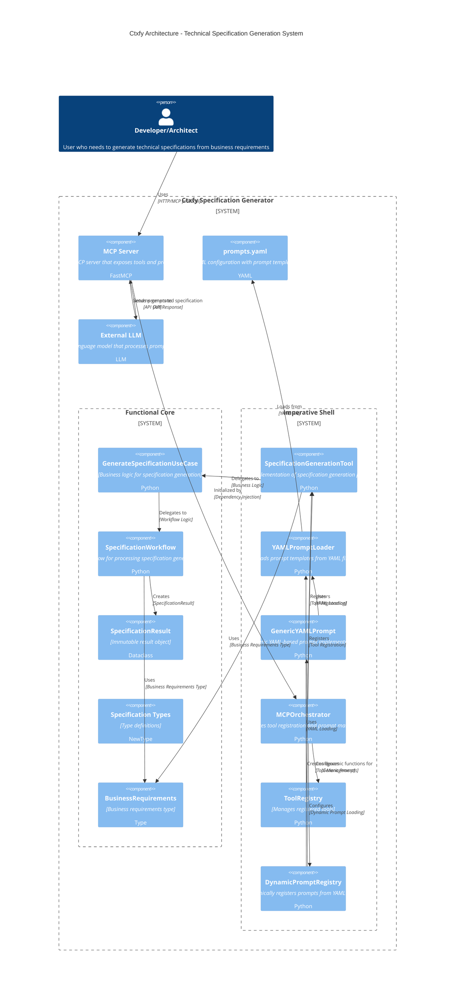

# Ctxfy Architecture - Technical Specification Generation System

This document provides a C4 component diagram visualization of the Ctxfy system architecture based on the Functional Core/Imperative Shell (FCIS) pattern.

## System Context

The Ctxfy system is designed to generate technical specifications from business requirements using a FastMCP-based server. It integrates with external LLM services to process prompts and generate comprehensive technical documentation.

## C4 Component Diagram

## Architecture Overview

The Ctxfy system follows the Functional Core/Imperative Shell (FCIS) architectural pattern as defined in the project's architecture rules:

### Functional Core
- **Models**: Immutable data structures and type definitions
- **Use Cases**: Pure business logic functions with no side effects
- **Ports**: Interface definitions (Protocols) defining contracts
- **Workflows**: Pure workflow definitions

### Imperative Shell
- **Adapters**: Implementation of core ports with side effects
- **Orchestrators**: Flow coordinators that manage component interactions
- **Registries**: Dynamic registration and management systems

### Key Design Principles
- Dependencies flow inward: shell → core
- No circular dependencies between packages
- Stable core packages don't depend on unstable shell packages
- Maximum 4 dependencies per orchestrator
- Proper port naming conventions followed

## How to Render

To view the visual diagram, you need to use a Markdown viewer that supports Mermaid diagrams, such as:
- GitHub
- GitLab
- Obsidian
- Mermaid Live Editor
- Any Markdown editor with Mermaid support