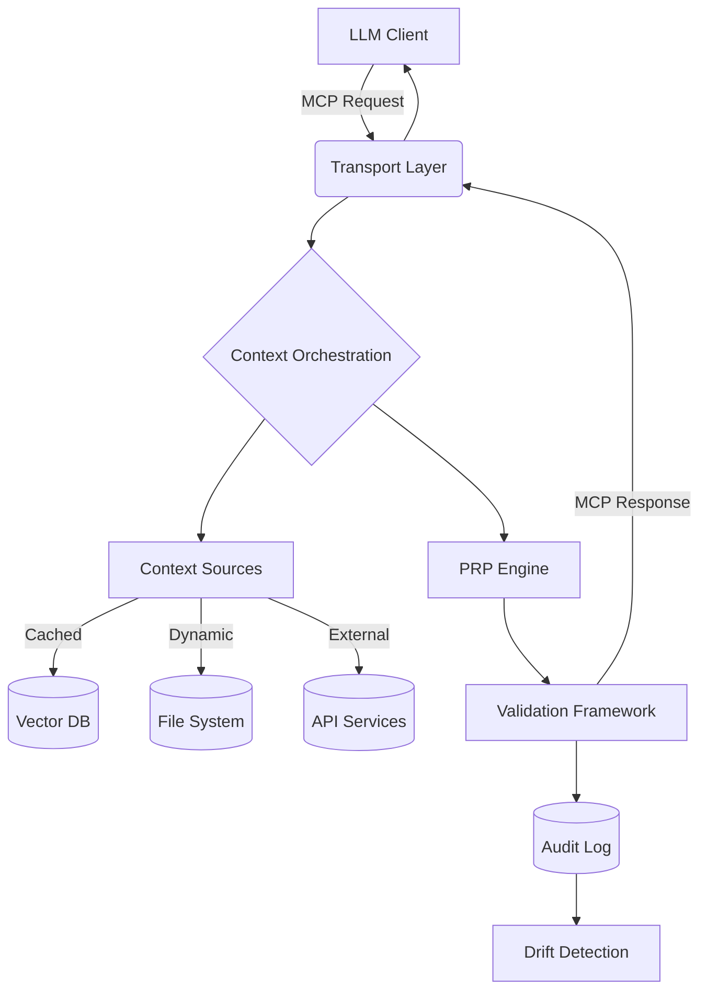

# MCP SERVER FOR CONTEXT ENGINEERING  
**One Pager - Technical Architecture & Implementation**

---

## **🔧 TECHNICAL VISION**  
A **Context Engineering MCP Server** implements the Model Context Protocol specification to provide deterministic, repeatable context delivery to coding agents. By decoupling context orchestration from application code, we transform prompt engineering from artisanal practice to industrialized process. This server acts as the single source of truth for context stacks and PRP (Product Requirements Prompts), ensuring consistent AI interactions regardless of model version changes.

---

## **🏗️ ARCHITECTURE**  

### Core Design Principles
- **Strangler Fig Pattern**: Incrementally replace ad-hoc prompt engineering with structured context delivery
- **Functional Core, Imperative Shell**: Pure context transformation logic + side-effect management
- **Protocol First**: Compliant MCP implementation with full lifecycle management
- **Zero-Trust Context Handling**: All context sources are validated and sandboxed

### System Components
| Layer | Technologies | Responsibilities | SLA Targets |
|-------|--------------|------------------|------------|
| **MCP Transport Layer** | FastMCP (Python), Streamable HTTP | Connection management, protocol encoding/decoding | 99.9% uptime |
| **Context Orchestration** | Pydantic, LangChain Core | Context stack assembly, validation, compression | <100ms latency |
| **PRP Engine** | Jinja2, YAML, JSON Schema | PRP template execution, resource injection | <200ms latency |
| **Dynamic Context Sources** | LlamaIndex, ChromaDB, FastAPI | RAG integration, knowledge retrieval, caching | <500ms latency |
| **Audit & Observability** | OpenTelemetry, Prometheus | Context versioning, usage metrics, drift detection | 10s granularity |

### Data Flow

---

## **⚡ PROTOCOL & INTEGRATIONS**  

### MCP Implementation Details
- **Transport**: STDIO (PoC phase) → Streamable HTTP (production)
- **Protocol Version**: 2025-06-18 (latest stable)
- **Capabilities**: Tools, Resources, Prompts, Elicitation
- **Lifecycle**: Full JSON-RPC handshake with capability negotiation

### Key Tools Exposed
| Tool Name | Input Schema | Output Format | Use Case |
|-----------|--------------|---------------|----------|
| `generate_context_stack` | `{story: string, files?: string[]}` | JSON-serialized context stack | Generate foundational context from requirements |
| `execute_prp_workflow` | `{context_stack: string, output_dir: string}` | Markdown files + JSON metadata | Execute full PRP generation workflow |
| `validate_context_quality` | `{context_stack: string, thresholds: object}` | Quality score + remediation suggestions | Ensure context meets minimum quality standards |
| `compress_context` | `{context_stack: string, compression_ratio: number}` | Optimized context with semantic preservation | Reduce token usage while maintaining fidelity |

### Resource Structure
- **URIs**: `context://stack/{project-id}/{feature-id}`
- **MIME Types**: `application/json+context-stack`, `application/markdown+prp`
- **Caching Strategy**: LRU cache with semantic versioning (ETag-based)

---

## **📈 SCALABILITY & PERFORMANCE**  

### Performance Targets
| Metric | Target | Measurement Method |
|--------|--------|---------------------|
| Context Generation | <1.5s p95 | Synthetic load testing |
| PRP Execution | <3s p95 | Real-world user flows |
| Memory Footprint | <250MB idle, <500MB peak | Container metrics |
| Concurrent Sessions | 50+ | Connection pool monitoring |

### Scaling Strategy
- **Horizontal Scaling**: Stateless context generation workers behind load balancer
- **Vertical Scaling**: GPU-accelerated embedding generation for RAG operations
- **Cold Start Optimization**: Pre-warmed context templates for common patterns
- **Connection Pooling**: Reusable STDIO pipes to minimize process spawning overhead

### Optimization Techniques
- Semantic context compression using distilled embeddings
- Differential context updates (only changed elements)
- Precomputed context fragments for common project structures
- Edge caching for public documentation sources

---

## **🔒 SECURITY & COMPLIANCE**  

### Security Model
- **Transport Security**: STDIO → TLS 1.3 for Streamable HTTP
- **Data Boundaries**: Strict sandboxing with filesystem allow-lists
- **Prompt Injection Protection**: Context validation via schema enforcement
- **PII Detection**: Automated scanning of context before transmission

### Compliance Framework
- **SOC 2 Type II**: Audit trails for all context modifications
- **GDPR/CCPA**: Right to be forgotten implementation for context history
- **Data Residency**: Configurable context storage locations
- **Approval Workflows**: Required confirmations for tool execution (configurable by security team)

### Risk Mitigation
- **Context Drift Detection**: Weekly diff analysis against baseline
- **Model Version Pinning**: Isolate context from model API changes
- **Break Glass Protocol**: Emergency circuit breaker for all AI interactions

---

## **🚀 TECHNICAL ROADMAP**  

| Quarter | Technical Deliverables | Success Metrics |
|---------|------------------------|-----------------|
| **Q4 2025** | PoC with STDIO transport; basic PRP templates; context validation framework | 90% tool call success rate; <2s response time |
| **Q1 2026** | Streamable HTTP transport; context versioning; audit logging | 99.5% uptime; full compliance audit pass |
| **Q2 2026** | RAG pipeline integration; context compression; multi-model support | 40% token reduction; 95% context fidelity |
| **Q3 2026** | Context marketplace API; CI/CD pipeline integration; drift detection | 50% reduction in model retraining events |

---

## **🛠️ TEAM & INFRASTRUCTURE REQUIREMENTS**  

### Core Team Composition
- **1 Staff Engineer**: Architecture, integration with Qwen Code
- **1 Senior SWE**: MCP protocol implementation, testing
- **1 DevOps Engineer**: Deployment, monitoring, observability
- **1 Security Engineer**: Security controls, compliance validation

### Infrastructure Needs
- **Development Environment**: VS Code + Qwen Code Extension + MCP Inspector
- **Testing**: Integration test harness with mock MCP clients
- **Production**: Containerized deployment (Kubernetes) with auto-scaling
- **Observability**: Unified logging (ELK stack), metrics (Prometheus/Grafana), tracing (Jaeger)

### Development Workflow
- MCP-first development practice with protocol compliance gates
- Infrastructure-as-Code (Terraform) for environment management
- Continuous validation against MCP specification conformance suite

---

## **✅ TECHNICAL SUCCESS METRICS**  

| Metric | Baseline | Target (6 months) | Measurement |
|--------|----------|-------------------|-------------|
| Protocol Compliance | 0% | 100% | Automated MCP spec tests |
| Context Fidelity | N/A | ≥0.92 | Context embedding similarity scoring |
| Error Rate | N/A | <0.5% | Failed tool calls / total calls |
| Mean Time To Recovery | N/A | <5 min | Monitoring system alerts |
| Resource Utilization | N/A | <60% CPU, <70% memory | Container metrics |
| Developer Velocity Impact | N/A | 40% faster context setup | Time tracking in IDE |

---

## **🎯 EXECUTION RISKS & MITIGATION**  

| Risk | Impact | Probability | Mitigation Strategy |
|------|--------|-------------|---------------------|
| MCP protocol changes breaking compatibility | High | Medium | Contribute to MCP specification; maintain abstraction layer |
| Context stack complexity causing latency | Medium | High | Progressive loading; differential updates; caching |
| Security vulnerabilities in context handling | Critical | Low | Regular penetration testing; strict context validation |
| Qwen Code integration instability | Medium | Medium | Maintain multiple MCP transport implementations |

---

## **💡 TECHNICAL INSIGHTS**  
*"Context Engineering isn't about prompts—it's about system design. By treating context as a first-class distributed system concern, we transform AI from a black box into a predictable component of our software delivery pipeline."*

**ARCHITECTURE OWNER:** Staff Software Engineer  
**APPROVAL STATUS:** Technical Design Approved  
**LAST UPDATED:** November 8, 2025  
**NEXT MILESTONE:** PoC validation with Qwen Code integration (Nov 30, 2025)